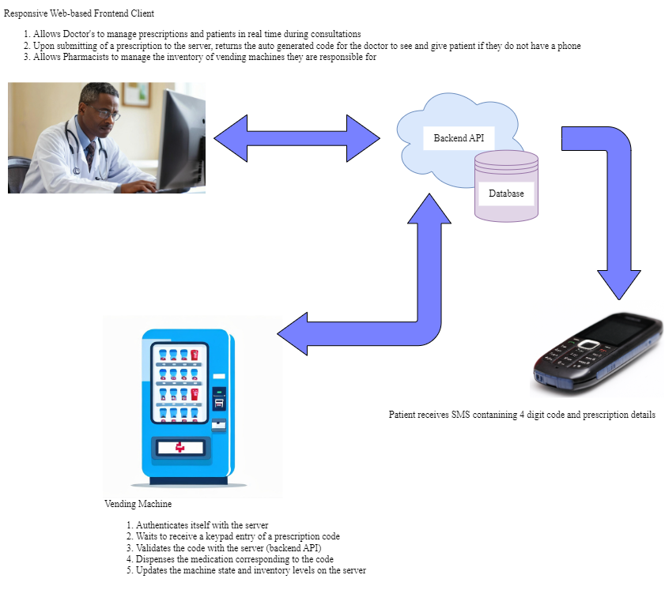
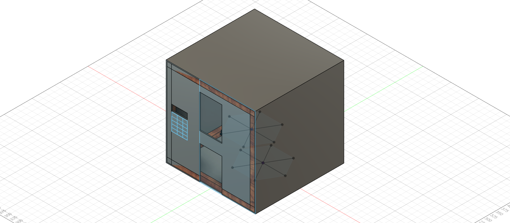

For our final year engineering project at MUBAS in 2024, Khumbolawo Mussa, Grace Chiwaya and I built a vending machine for prescription medication. A doctor writes a prescription, the patient gets an SMS with a 4-digit code, and the machine hands over exactly what was prescribed when they type that code in.

## How it works



1. **The doctor writes the prescription** in a web app: the patient, the condition, the medication and how to take it.
2. **The server generates a 4-digit code** for that prescription. It picks one at random and tries again until it finds a code no other prescription is using.
3. **The patient gets an SMS** with the code, the medication names and the instructions. Not everyone has a phone, or a charged one, so the code also appears on the doctor's screen to be copied onto paper or into the patient's health passport.
4. **The patient types the code** on the machine's keypad, with a 16x2 LCD showing what they've entered. The machine's prompts are in Chichewa and English.
5. **The machine checks the code with the server.** If it belongs to a prescription that hasn't been dispensed, the server replies with the list of slots holding those medications.
6. **The carousel turns** to each slot in turn, and the patient collects their medication.
7. **The prescription is marked as dispensed**, so the same code can't be used again, on this machine or any other.

The machine is an ESP32 driving a NEMA 17 stepper motor through an L298N driver, with a 4x4 keypad and an I2C LCD. When it boots it connects to Wi-Fi, logs in to the backend and gets a JWT token, so the server knows which machine is asking. Every request after that carries the token over HTTPS. The backend is Django with Django REST Framework, the web app uses Tailwind, and the SMS went out through Twilio.



## Turning the carousel the short way

The part I'm still most fond of is small. The carousel has six slots arranged in a circle. A prescription might need medication from slots 5, 1 and 3, and the machine is currently sitting at slot 2. Which order should it visit them in?

Going 5, 1, 3 in the order they come out of the database means the motor swings back and forth. On a circle you can go either way, so the distance from one slot to another is whichever is shorter, clockwise or anticlockwise. The server orders the slots by always moving to the nearest one next:

```python
def get_shortest_path(current, target, total_slots):
    clockwise = (target - current + total_slots) % total_slots
    anticlockwise = (current - target + total_slots) % total_slots
    return min(clockwise, anticlockwise)

while available_slots:
    next_slot = min(available_slots, key=lambda s: get_shortest_path(current_slot, s, total_slots))
    sorted_slots.append(next_slot)
    available_slots.remove(next_slot)
    current_slot = next_slot
```

From slot 2, that visits 1, then 5 (two steps back round the circle, not four forward), then 3. Less motor travel means a faster handover and less wear on the mechanism. Always picking the nearest next stop isn't guaranteed to be the best route in general, but with six slots it gets close enough, and it's easy to reason about. To make it work, the machine reports which slot it's sitting at with every request.

## The doctors' side

Healthcare data is about as sensitive as data gets, so we designed with HIPAA in mind even though it isn't Malawian law. The API only talks over HTTPS. Access is role-based: a doctor only sees the prescriptions they wrote, and pharmacists manage the stock in the machines they're responsible for. The machine itself only ever learns slot numbers. It never sees a patient's name or condition.

## What I'd change now

Looking at it two years later, there are things I'd do differently.

**Four digits is not much of a secret.** There are 10,000 possible codes. The code proves you know a number, not that you're the patient. Today I'd make codes expire after a set time, limit wrong attempts at the keypad, and use longer codes for medication that is worth stealing.

**The prescription is marked as dispensed too early.** The server marks the code as used the moment it sends the slot list, before the carousel has turned and before the patient has anything in hand. If the motor jams, the patient's code is spent and they have nothing. The machine should confirm the handover first.

**The SMS came from a US number.** We used Twilio, so every message went out from a foreign number and cost real money per message. Doing it properly in Malawi means working with a local SMS gateway or a mobile network. I ran into the same Twilio problem again with Lucy.

## Where it leads

The natural next step for a machine like this is checking who is standing in front of it. A code can be shared or stolen; a face or a national ID can't, as easily. That means running identity verification on the machine itself, on a small processor, in a place where the network might drop. It's the same problem as FRACS, my face recognition door, and the same problem I now work on at the bank with ID validation: a system making a decision about a real person, with perception that used to need a GPU, on hardware that will never have one.

The code, circuit diagrams and 3D designs are on [GitHub](https://github.com/Victor-M16/Smart-Pharmacist).
