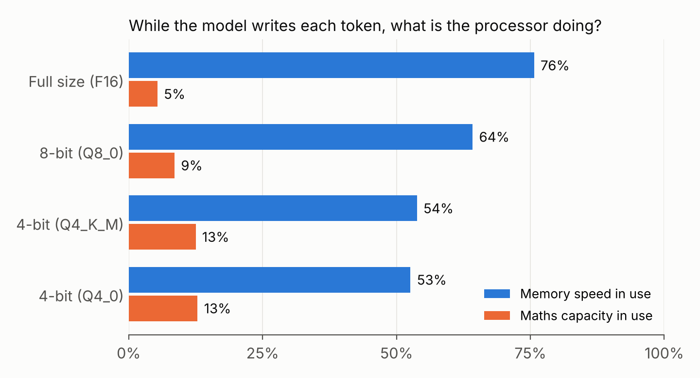

When people talk about running AI models, the conversation usually starts and ends with GPUs. I understand why. But I work in a country where almost every cloud and API bill is paid in dollars, sometimes at parallel market rates, and that changes the question I care about. It is less "which GPU do I rent?" and more "how much can I do with hardware that is already here?"

This post is about the thing that pushed me to take that question seriously.

## A service that was slower than it should have been

At my day job I built an image-processing service that runs OCR and barcode scanning on every request. Locally it was fast. In production it was noticeably slower, and my first instinct was the usual one: blame the code, then the network.

Neither was the problem. When I finally measured properly, two things stood out.

First, the production machine was a virtual machine with a lower clock speed than my development laptop. A chunk of what I had called "slow code" was simply a slower processor. On top of that, a VM shares a physical host with other tenants, so there is a real chance of the hypervisor taking CPU time away from you. Your code is fine, and your cores are still not entirely yours.

Second, and more surprising, was how I should split the work across cores. The obvious plan is to give each worker several cores. In my load tests, the opposite won: one worker pinned to one core beat workers that each got several. My best explanation is that the math libraries underneath spent more time coordinating threads than doing useful work. More cores per worker meant more waiting, not more speed.

I carried the relative result into production planning, and treated the absolute numbers as unproven until tested on the real hardware, because a laptop's higher clock speed flatters everything.

## Why this is really an inference story

That experience was a small version of a much bigger problem. Generating text from a transformer one token at a time is usually limited by how fast the processor can move model weights out of memory, not by how fast it can multiply. A GPU has memory bandwidth measured in terabytes per second. A typical CPU has tens to a few hundred gigabytes per second. That gap is the honest reason CPUs struggle with large models, and it is why shrinking the weights (quantization), reading fewer of them (sparsity), and reusing what is already in cache all matter so much.

It is also why I find CPUs interesting rather than inferior. They are everywhere, they are what most organisations already own, and decades of architecture work went into making them good at exactly the thing my OCR service taught me about: getting data to the right place at the right time.

## So I measured it

That paragraph is a claim, and I wanted numbers. So I built a small open benchmark, [cpu-inference-roofline](https://github.com/Victor-M16/cpu-inference-roofline), and ran it.

The model was the size of TinyLlama, a small language model with 1.1 billion parameters. I ran it with llama.cpp, a popular open-source engine for running models on ordinary computers, in four sizes: full size (F16, about 2.2 GB), an 8-bit version (Q8_0, 1.2 GB) and two 4-bit versions (Q4_K_M and Q4_0, about 0.65 GB each). The machine was a cloud virtual machine with 4 cores of an Intel Xeon. Before running the model, a small program I wrote measured the machine's two limits: how fast it can read from memory (34 GB per second) and how much maths it can do (about 480 billion operations per second).

One word you need: models write text in **tokens**, a word or a piece of a word at a time. To write one token, the model has to read nearly all of its weights from memory once.

### The kitchen picture

Think of the processor as a chef, and memory as a pantry down the corridor. To cook one token, the chef needs every ingredient in the pantry. The cooking is quick. The walking is not.

When the model reads your prompt, it can cook hundreds of tokens per trip, because they all use the same ingredients. When it writes its reply, it cooks one token at a time, and makes the whole trip for each one.

### What I found

**1. While it writes, the processor mostly waits.**

In every size, memory was the busy part and the maths units sat mostly idle: never more than 13% of the maths capacity was in use. When the same model read a 512-token prompt on the same cores, it used between 43% and 72% of the maths. Same model, same machine, opposite bottleneck.

**2. Compressing the model helps, but less than you would expect.**

The 4-bit model reads 3.45 times less data per token than the full-size one. It writes 2.4 times faster, not 3.45.

The black curve is the speed you would get if reading memory were the only cost. The full-size model sits close to it. The smaller the model, the further below the curve it falls. Back in the kitchen: the ingredients are vacuum-packed now, so each trip is shorter, but the chef has to unpack them at the bench before cooking, and that unpacking starts to show. Compression shortens the walk. It does not change how the kitchen is laid out.

**3. Long conversations cost more than their size.**

As a conversation grows, the model keeps notes on everything said so far (the "KV cache") and rereads them for every new token. About 2,000 tokens into a conversation, those notes added only 8% to the data read per token, but the 4-bit model slowed down by 42%, from 30 to 17.5 tokens per second. Size alone doesn't explain that. How the notes are laid out in memory, and how well they fit in the processor's caches, seems to matter more than how big they are. Keeping the right data close at hand is exactly what CPU caches were designed for, which is why this is the result I most want to dig into.

**4. More cores, smaller returns.**

Going from 1 to 4 cores made memory reads 3.6 times faster, but writing only got 3.0 times faster. My best guess is that part of each extra core goes to keeping the cores in step at every stage of every token. It is the same shape of lesson my OCR service taught me: past a point, coordinating cores eats into what they add.

### What I'm not claiming yet

This is one machine, and a virtual one. The first time I measured its memory speed, I got half the real number, because a large compile happened to be running on the same cores. Your cores are not entirely yours, again. The model's weights were random numbers in the real model's shapes, because my network couldn't download the real one. Speed doesn't depend on the values, but the replies were gibberish. And these numbers show where the time goes, not yet why: findings 2 and 3 need the processor's hardware counters to explain.

Next, I want to repeat all of this on older laptops, the kind of machines that banks, schools and offices in Malawi actually run. The code and the data are public. If you have an old laptop, you can run it and add your results.

## Why Malawi makes this personal

I have been building [Lucy](/blog/lucy-picked-up-the-phone/), a Chichewa and English voice assistant you reach with an ordinary phone call. For tools like that to be useful to the people who need them, they cannot depend on paying a foreign provider per request, or on a data centre we do not have. A model that runs acceptably on a CPU is a model that a clinic, a bank branch or a district office could run itself. For me, digital transformation that quietly drains foreign reserves has not really transformed anything.

## The question I want to spend years on

I do not claim to have solved this. What I have is a conviction and a habit: measure first, and treat the hardware as part of the problem.

The open question is not how small a GPU-shaped model can be shrunk before it fits on a CPU. It is what a transformer would look like if it were designed for the CPU from the start, built around its caches, its branch prediction and its strong single-thread speed, while staying compatible with the machines people already have. And what that would mean for who gets to own AI built for Malawi.

The measurements make the question sharper. The time a CPU loses to unpacking compressed weights, and to rereading a growing conversation, is not something compression fixes. It comes from how the work is arranged, and that makes it a computer architecture question.

That is the work I want to do next.
